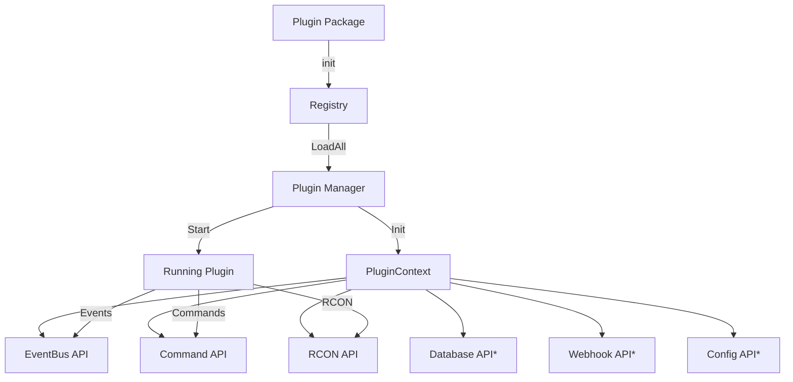

<div align="center">

# 🔌 GoAdmin Plugin System

### Extensible Architecture for Custom Server Functionality

[](PLUGINS.md)
[](https://go.dev/)
[](LICENSE)

**Build powerful extensions for GoAdmin with event subscriptions, custom commands, and full RCON access.**

[Quick Start](#-quick-start) • [API Reference](#-plugin-apis) • [Examples](#-example-plugins) • [Best Practices](#-best-practices)

</div>

---

## 📋 Table of Contents

- [Overview](#-overview)
- [Architecture](#-architecture)
- [Plugin APIs](#-plugin-apis)
- [Quick Start](#-quick-start)
- [Creating Plugins](#-creating-a-plugin)
- [Plugin Management](#-plugin-management)
- [Example Plugins](#-example-plugins)
- [Best Practices](#-best-practices)
- [Troubleshooting](#-troubleshooting)

---

## 🎯 Overview

GoAdmin's plugin system enables extending server functionality without modifying core code. Plugins are Go packages compiled directly into the binary, offering:

<table>
<tr>
<td width="50%">

✅ **Event-Driven Architecture**

- Subscribe to player events
- React to server state changes
- Async event handlers

✅ **Custom Commands**

- Register in-game commands
- Go callback functions
- Automatic validation

</td>
<td width="50%">

✅ **Full RCON Access**

- Execute server commands
- Send messages to players
- Manage server state

✅ **Runtime Control**

- Start/Stop/Reload via UI
- No restart required
- State management

</td>
</tr>
</table>

---

## 🏗️ Architecture

### Core Components



<details>
<summary><b>Component Details</b></summary>

#### 1. Plugin Interface

**File:** `app/plugins/plugin.go`

Defines the contract all plugins must implement:

- `Metadata()` - Plugin information
- `Init(ctx)` - Initialize with context
- `Start()` - Begin operation
- `Stop()` - Cleanup and shutdown
- `Reload()` - Refresh configuration

#### 2. Plugin Registry

**File:** `app/plugins/registry.go`

Global registry managing plugin registration:

- Thread-safe operations (`sync.RWMutex`)
- Self-registration via `init()`
- Plugin discovery and enumeration

#### 3. Plugin Manager

**File:** `app/plugins/registry.go`

Controls plugin lifecycle:

- Loads registered plugins on startup
- Manages state transitions
- Tracks errors and status
- Provides API access

#### 4. Plugin Context

**File:** `app/plugins/plugin.go`

Provides API access to plugins:

- 6 API surfaces (3 implemented, 3 planned)
- Cancellation context for graceful shutdown
- Shared state management

</details>

---

## 🔧 Plugin APIs

<div align="center">

### Available APIs

| API             | Status       | Purpose                          |
| --------------- | ------------ | -------------------------------- |
| 🟢 **EventBus** | ✅ Available | Subscribe to server events       |
| 🟢 **Command**  | ✅ Available | Register custom in-game commands |
| 🟢 **RCON**     | ✅ Available | Execute server commands          |
| 🟡 **Database** | 🚧 Planned   | Direct database access           |
| 🟡 **Webhook**  | 🚧 Planned   | Trigger external webhooks        |
| 🟡 **Config**   | 🚧 Planned   | Persistent plugin settings       |

</div>

### 1️⃣ EventBus API

Subscribe to and publish server events.

**Methods:**

```go
Subscribe(eventType string, handler EventCallback)
Unsubscribe(eventType string, handler EventCallback)
Publish(eventType string, data interface{})
```

**Available Events:**

| Event               | Description          | Data Type     |
| ------------------- | -------------------- | ------------- |
| `player.connect`    | Player joined server | `PlayerEvent` |
| `player.disconnect` | Player left server   | `PlayerEvent` |
| `player.banned`     | Player was banned    | `BanEvent`    |
| `player.kicked`     | Player was kicked    | `KickEvent`   |
| `report.created`    | Report submitted     | `ReportEvent` |
| `report.actioned`   | Report resolved      | `ActionEvent` |

**Example:**

```go
func (p *MyPlugin) Start() error {
    p.ctx.EventBus.Subscribe("player.connect", func(data interface{}) {
        playerData := data.(map[string]interface{})
        playerName := playerData["name"].(string)

        p.ctx.RCONAPI.SendCommand(fmt.Sprintf(
            `say "^2Welcome ^7%s^2!"`, playerName,
        ))
    })
    return nil
}
```

---

### 2️⃣ Command API

Register custom in-game commands with Go callbacks.

**Methods:**

```go
RegisterCommand(definition CommandDefinition)
UnregisterCommand(name string)
ExecuteCommand(playerName, playerGUID, command string, args []string)
```

**Command Definition:**

```go
type CommandDefinition struct {
    Name        string              // Command name (used as !name)
    Usage       string              // Usage help text
    Description string              // Detailed description
    MinArgs     int                 // Minimum arguments (0+)
    MaxArgs     int                 // Maximum arguments (-1 = unlimited)
    MinPower    int                 // Minimum group power (0-100)
    Permissions []string            // Required permissions
    Handler     CommandHandlerFunc  // Callback function
}
```

**Features:**

- ✅ Automatic argument validation
- ✅ Power level checking
- ✅ Permission validation
- ✅ Error messages via RCON
- ✅ Priority over built-in commands

**Example:**

```go
p.ctx.CommandAPI.RegisterCommand(plugins.CommandDefinition{
    Name:        "time",
    Usage:       "time",
    Description: "Shows current server time",
    MinArgs:     0,
    MaxArgs:     0,
    MinPower:    0,
    Handler: func(playerName, playerGUID string, args []string) error {
        currentTime := time.Now().Format("15:04:05")
        p.ctx.RCONAPI.SendCommand(fmt.Sprintf(
            `tell %s "^3Server time: ^7%s"`, playerName, currentTime,
        ))
        return nil
    },
})
```

---

### 3️⃣ RCON API

Execute RCON commands on the game server.

**Methods:**

```go
SendCommand(command string) (string, error)
SendCommandWithTimeout(command string, timeout time.Duration) (string, error)
GetStatus() (ServerStatus, error)
```

**Features:**

- ✅ Direct RCON client access
- ✅ Async execution (non-blocking)
- ✅ Timeout control
- ✅ Error handling

**Common Commands:**

<details>
<summary><b>Message Commands</b></summary>

```go
// Broadcast to all players
p.ctx.RCONAPI.SendCommand(`say "^2Server restart in 5 minutes"`)

// Private message to player
p.ctx.RCONAPI.SendCommand(fmt.Sprintf(
    `tell %s "^2Welcome to the server!"`, playerName,
))
```

</details>

<details>
<summary><b>Player Management</b></summary>

```go
// Kick player
p.ctx.RCONAPI.SendCommand(fmt.Sprintf("clientkick %s", playerID))

// Ban player
p.ctx.RCONAPI.SendCommand(fmt.Sprintf("ban %s", playerName))
```

</details>

<details>
<summary><b>Server Control</b></summary>

```go
// Change map
p.ctx.RCONAPI.SendCommand("map mp_crash")

// Restart map
p.ctx.RCONAPI.SendCommand("fast_restart")

// Set CVAR
p.ctx.RCONAPI.SendCommand("set g_gravity 800")
```

</details>

---

### 4️⃣ Database API 🚧

**Status:** Planned - Not yet implemented

Direct database access using GORM.

**Planned Methods:**

```go
GetDB() *gorm.DB
Query(sql string, args ...interface{}) (*sql.Rows, error)
Exec(sql string, args ...interface{}) (sql.Result, error)
```

---

### 5️⃣ Webhook API 🚧

**Status:** Planned - Not yet implemented

Dispatch custom webhook events to external services.

**Planned Methods:**

```go
Dispatch(eventType string, data interface{}) error
RegisterEvent(eventType string) error
```

---

### 6️⃣ Config API 🚧

**Status:** Planned - Not yet implemented

Persistent plugin configuration storage.

**Planned Methods:**

```go
Get(key string) (interface{}, error)
Set(key string, value interface{}) error
GetString(key string) (string, error)
GetInt(key string) (int, error)
GetBool(key string) (bool, error)
```

---

## ⚡ Quick Start

### 1. Create Plugin File

**File:** `plugins/myplugin/myplugin.go`

```go
package myplugin

import "github.com/ethanburkett/goadmin/app/plugins"

type MyPlugin struct {
    ctx *plugins.PluginContext
}

func (p *MyPlugin) Metadata() plugins.PluginMetadata {
    return plugins.PluginMetadata{
        ID:          "my-plugin",
        Name:        "My Plugin",
        Version:     "1.0.0",
        Author:      "Your Name",
        Description: "Does awesome things",
    }
}

func (p *MyPlugin) Init(ctx *plugins.PluginContext) error {
    p.ctx = ctx
    return nil
}

func (p *MyPlugin) Start() error {
    // Your plugin logic here
    return nil
}

func (p *MyPlugin) Stop() error {
    return nil
}

func (p *MyPlugin) Reload() error {
    return nil
}

func init() {
    plugins.Registry.Register(&MyPlugin{})
}
```

### 2. Auto-Import

```powershell
.\scripts\build_plugins.ps1
```

### 3. Build & Run

```bash
go build -o goadmin app/main.go
# Or use: pnpm dev (auto-rebuilds)
```

### 4. Verify

Navigate to **Dashboard → Plugins** to see your plugin!

---

## 🛠️ Creating a Plugin

### Plugin Lifecycle

```
┌─────────────────────────────────────────┐
│ 1. REGISTER   init() → Registry         │
├─────────────────────────────────────────┤
│ 2. IMPORT     Auto-import script         │
├─────────────────────────────────────────┤
│ 3. LOAD       Manager discovers plugin   │
├─────────────────────────────────────────┤
│ 4. INIT       Init(ctx) provides APIs    │
├─────────────────────────────────────────┤
│ 5. START      Start() activates plugin   │
├─────────────────────────────────────────┤
│ 6. RUNNING    Handle events & commands   │
├─────────────────────────────────────────┤
│ 7. RELOAD     Reload() refreshes config  │
├─────────────────────────────────────────┤
│ 8. STOP       Stop() cleanup & shutdown  │
└─────────────────────────────────────────┘
```

### Full Plugin Example

```go
package myplugin

import (
    "fmt"
    "time"
    "github.com/ethanburkett/goadmin/app/plugins"
)

type MyPlugin struct {
    ctx      *plugins.PluginContext
    ticker   *time.Ticker
    stopChan chan bool
}

func (p *MyPlugin) Metadata() plugins.PluginMetadata {
    return plugins.PluginMetadata{
        ID:          "my-awesome-plugin",
        Name:        "My Awesome Plugin",
        Version:     "1.0.0",
        Author:      "Your Name",
        Description: "Does awesome things every 30 seconds",
        Website:     "https://example.com",
        Permissions: []string{"rcon.execute"},
    }
}

func (p *MyPlugin) Init(ctx *plugins.PluginContext) error {
    p.ctx = ctx
    p.stopChan = make(chan bool)
    return nil
}

func (p *MyPlugin) Start() error {
    // Recreate channels for proper restart
    p.stopChan = make(chan bool)
    p.ticker = time.NewTicker(30 * time.Second)

    // Subscribe to events
    p.ctx.EventBus.Subscribe("player.connect", func(data interface{}) {
        playerData := data.(map[string]interface{})
        name := playerData["name"].(string)

        p.ctx.RCONAPI.SendCommand(fmt.Sprintf(
            `say "^2Welcome ^7%s ^2to our server!"`, name,
        ))
    })

    // Register custom command
    p.ctx.CommandAPI.RegisterCommand(plugins.CommandDefinition{
        Name:        "hello",
        Usage:       "hello",
        Description: "Says hello to you",
        MinArgs:     0,
        MaxArgs:     0,
        Handler: func(playerName, playerGUID string, args []string) error {
            p.ctx.RCONAPI.SendCommand(fmt.Sprintf(
                `tell %s "^2Hello ^7%s^2!"`, playerName, playerName,
            ))
            return nil
        },
    })

    // Background task
    go func() {
        for {
            select {
            case <-p.ticker.C:
                p.ctx.RCONAPI.SendCommand(`say "^3Tick!"`)
            case <-p.stopChan:
                return
            }
        }
    }()

    fmt.Println("[MyPlugin] Started")
    return nil
}

func (p *MyPlugin) Stop() error {
    if p.ticker != nil {
        p.ticker.Stop()
    }

    close(p.stopChan)

    // Unregister commands
    p.ctx.CommandAPI.UnregisterCommand("hello")

    fmt.Println("[MyPlugin] Stopped")
    return nil
}

func (p *MyPlugin) Reload() error {
    fmt.Println("[MyPlugin] Reloaded")
    return nil
}

func init() {
    plugins.Registry.Register(&MyPlugin{})
}
```

---

## 🎛️ Plugin Management

### REST API Endpoints

| Method | Endpoint              | Description        |
| ------ | --------------------- | ------------------ |
| `GET`  | `/plugins`            | List all plugins   |
| `GET`  | `/plugins/:id`        | Get plugin details |
| `POST` | `/plugins/:id/start`  | Start plugin       |
| `POST` | `/plugins/:id/stop`   | Stop plugin        |
| `POST` | `/plugins/:id/reload` | Reload plugin      |

### Web Dashboard

Navigate to **Plugins** in the sidebar:

- 📋 View all registered plugins
- 🟢 See real-time status (Running, Stopped, Error)
- ▶️ Start/Stop/Reload controls
- 📊 View metadata and permissions
- 🔗 Monitor dependencies

### Required Permissions

- `plugins.view` - View plugin list and status
- `plugins.manage` - Start, stop, reload plugins

---

## 📦 Example Plugins

### 1. Example Plugin

**Location:** `plugins/examples/example/example.go`

**Features:**

- ✅ Event subscriptions (connect/disconnect)
- ✅ Custom commands (`!hello`, `!time`, `!echo`)
- ✅ RCON integration
- ✅ Proper lifecycle management

**Usage:**

```bash
!hello          # Get greeted
!time           # See server time
!echo test msg  # Echo back: test msg
```

---

### 2. Auto Messages Plugin

**Location:** `plugins/auto-messages/auto-messages.go`

**Features:**

- ✅ Periodic broadcasts (every 30 seconds)
- ✅ Custom command (`!nextmsg`)
- ✅ Configurable message list
- ✅ Production-ready

**Usage:**

```bash
!nextmsg  # Preview next scheduled message
```

**Messages:**

```go
p.messages = []string{
    "Welcome to the server!",
    "Join our Discord: discord.gg/example",
    "Report bugs with !report",
    "Check your stats with !stats",
}
```

---

## ✅ Best Practices

<table>
<tr>
<td width="50%">

### Development

1. ✅ Use `.\scripts\build_plugins.ps1` for imports
2. ✅ Call `Registry.Register()` in `init()`
3. ✅ Use semantic versioning (1.0.0)
4. ✅ Lowercase package names
5. ✅ Document all exported functions

</td>
<td width="50%">

### Runtime

6. ✅ Cleanup in `Stop()` (unsubscribe, unregister)
7. ✅ Recreate channels/tickers in `Start()`
8. ✅ Don't block in event handlers
9. ✅ Return errors from lifecycle methods
10. ✅ Request required permissions

</td>
</tr>
</table>

---

## 🔍 Troubleshooting

### Plugin Not Appearing

<details>
<summary><b>Solution Steps</b></summary>

1. Run auto-import script:

   ```powershell
   .\scripts\build_plugins.ps1
   ```

2. Verify `init()` function:

   ```go
   func init() {
       plugins.Registry.Register(&MyPlugin{})
   }
   ```

3. Rebuild binary:

   ```bash
   go build -o goadmin.exe ./app
   ```

4. Restart GoAdmin

5. Check logs for registration errors

</details>

---

### Plugin Crashes on Start

<details>
<summary><b>Common Causes</b></summary>

- ❌ Missing required permissions
- ❌ Dependencies not available
- ❌ Errors in `Init()` or `Start()`
- ❌ EventBus/APIs not initialized

**Fix:** Review error logs and verify all dependencies

</details>

---

### Events Not Firing

<details>
<summary><b>Checklist</b></summary>

- ✅ Subscription in `Start()` method
- ✅ Event type spelling (case-sensitive)
- ✅ Plugin state is "Running"
- ✅ Event handler function signature correct

</details>

---

### Messages Not Stopping After Plugin Stop

<details>
<summary><b>Solution</b></summary>

Recreate channels in `Start()`:

```go
func (p *MyPlugin) Start() error {
    p.stopChan = make(chan bool)  // Recreate channel
    p.ticker = time.NewTicker(30 * time.Second)

    go func() {
        for {
            select {
            case <-p.ticker.C:
                // Handle tick
            case <-p.stopChan:
                return
            }
        }
    }()

    return nil
}
```

</details>

---

## 🏛️ Architecture Notes

**Registry-Based Compilation:**

- ✅ Cross-platform (Windows, Linux, macOS)
- ✅ Single executable deployment
- ✅ No dynamic library issues
- ⚠️ Requires rebuild to add/remove plugins
- ✅ Runtime lifecycle control (start/stop/reload)

---

## 🚀 Future Enhancements

- 🔜 Database API implementation
- 🔜 Webhook API implementation
- 🔜 Config API implementation
- 🔜 Dependency validation
- 🔜 Version compatibility checks
- 🔜 Resource usage monitoring
- 🔜 UI extension points
- 🔜 Additional event types
- 🔜 Configuration UI
- 🔜 Plugin marketplace

---

## 🔒 Security

<table>
<tr>
<td width="50%">

### ⚠️ Plugin Capabilities

- Full database access
- Execute any RCON command
- Run with GoAdmin permissions
- Access to all server events

</td>
<td width="50%">

### ✅ Safety Measures

- **Review code** before importing
- Use permission system
- Monitor resource usage
- Audit via audit log
- Only enable trusted plugins

</td>
</tr>
</table>

---

<div align="center">

### 📚 Additional Resources

[Main README](README.md) • [Report Issue](https://github.com/ethanburkett/GoAdmin/issues) • [Request Feature](https://github.com/ethanburkett/GoAdmin/issues/new)

Made with ❤️ for the CoD4 community

</div>

## Architecture

### Core Components

1. **Plugin Interface** (`app/plugins/plugin.go`)

   - Defines the contract all plugins must implement
   - Lifecycle methods: `Init()`, `Start()`, `Stop()`, `Reload()`
   - Metadata method: `Metadata()` returns plugin information

2. **Plugin Registry** (`app/plugins/registry.go`)

   - Global registry for plugin registration
   - Plugins self-register via `init()` functions
   - Thread-safe operations using `sync.RWMutex`

3. **Plugin Manager** (`app/plugins/registry.go`)

   - Loads all registered plugins on startup
   - Manages plugin lifecycle (start, stop, reload)
   - Tracks plugin state and errors

4. **Plugin Context** (`app/plugins/plugin.go`)
   - Provides plugins access to GoAdmin APIs
   - Includes cancellation context for graceful shutdown
   - 6 API surfaces available to plugins

### Plugin APIs

Plugins have access to these APIs through the `PluginContext`:

#### 1. EventBus API

- **Purpose**: Subscribe to and publish events
- **Methods**:
  - `Subscribe(eventType, handler)` - Listen for events
  - `Unsubscribe(eventType, handler)` - Stop listening
  - `Publish(eventType, data)` - Trigger events

**Available Events**:

- `player.connect` - Player joined server
- `player.disconnect` - Player left server
- `player.banned` - Player was banned
- `player.kicked` - Player was kicked
- `report.created` - Report submitted
- `report.actioned` - Report resolved

#### 2. Command API

- **Purpose**: Register custom in-game commands
- **Methods**:
  - `RegisterCommand(definition)` - Add custom command
  - `UnregisterCommand(name)` - Remove command
  - `ExecuteCommand(playerName, playerGUID, command, args)` - Trigger command programmatically

**Command Definition**:

```go
plugins.CommandDefinition{
    Name:        "hello",           // Command name (used as !hello)
    Usage:       "hello",            // Usage help text
    Description: "Says hello",       // Command description
    MinArgs:     0,                  // Minimum arguments required
    MaxArgs:     0,                  // Maximum arguments (-1 = unlimited)
    MinPower:    0,                  // Minimum group power level
    Permissions: []string{},         // Required permissions
    Handler:     func(playerName, playerGUID string, args []string) error {
        // Command logic here
        return nil
    },
}
```

**Features**:

- Automatic argument validation
- Power level checking (uses in-game group system)
- Permission validation (checks group permissions)
- Error messages sent to player via RCON
- Integrated with command handler (plugin commands checked first)

**Example**: Register `!hello` command that greets players, `!time` shows server time

#### 3. RCON API

- **Purpose**: Execute RCON commands on game servers
- **Methods**:
  - `SendCommand(command)` - Execute raw RCON command
  - `SendCommandWithTimeout(command, timeout)` - Execute with custom timeout
  - `GetStatus()` - Get server status information

**Features**:

- Direct access to RCON client
- Async command execution (non-blocking)
- Error handling and timeout control
- Full access to all RCON commands

**Examples**:

```go
// Send a message to all players
p.ctx.RCONAPI.SendCommand(`say "^2Server restart in 5 minutes"`)

// Send private message to player
p.ctx.RCONAPI.SendCommand(fmt.Sprintf(`tell %s "^2Welcome!"`, playerName))

// Kick a player
p.ctx.RCONAPI.SendCommand(fmt.Sprintf("clientkick %s", playerID))

// Change map
p.ctx.RCONAPI.SendCommand("map mp_crash")
```

#### 4. Database API

- **Purpose**: Direct database access using GORM
- **Methods**:
  - `GetDB()` - Get GORM database instance
  - `Query(sql, args...)` - Execute SELECT query
  - `Exec(sql, args...)` - Execute INSERT/UPDATE/DELETE

**Note**: Not yet implemented. Use standard Go database access for now.

**Example**: Query player statistics, store plugin data

#### 5. Webhook API

- **Purpose**: Dispatch custom webhook events
- **Methods**:
  - `Dispatch(eventType, data)` - Trigger webhook
  - `RegisterEvent(eventType)` - Register new event type

**Note**: Not yet implemented.

**Example**: Notify external services of plugin events

#### 6. Config API

- **Purpose**: Persistent plugin configuration storage
- **Methods**:
  - `Get(key)` - Retrieve config value
  - `Set(key, value)` - Store config value
  - `GetString(key)`, `GetInt(key)`, `GetBool(key)` - Typed getters

**Note**: Not yet implemented. Use environment variables or config files for now.

**Example**: Store greeting messages, thresholds, toggles

## Plugin Lifecycle

```
1. REGISTER → Plugin calls Registry.Register() in init()
2. IMPORT   → Plugin package imported in main.go
3. LOAD     → Manager.LoadAll() discovers registered plugins
4. INIT     → Init() called with PluginContext
5. START    → Start() called, subscriptions/registrations occur
6. RUNNING  → Plugin handles events and commands
7. RELOAD   → Reload() called to refresh config
8. STOP     → Stop() called, cleanup subscriptions
```

## Quick Start Guide

1. **Create your plugin file** (`plugins/myplugin/myplugin.go`):

   ```go
   package myplugin

   import "github.com/ethanburkett/goadmin/app/plugins"

   type MyPlugin struct {
       ctx *plugins.PluginContext
   }

   func (p *MyPlugin) Metadata() plugins.PluginMetadata {
       return plugins.PluginMetadata{
           ID:      "my-plugin",
           Name:    "My Plugin",
           Version: "1.0.0",
       }
   }

   func (p *MyPlugin) Init(ctx *plugins.PluginContext) error {
       p.ctx = ctx
       return nil
   }

   func (p *MyPlugin) Start() error {
       // Your plugin logic here
       return nil
   }

   func (p *MyPlugin) Stop() error { return nil }
   func (p *MyPlugin) Reload() error { return nil }

   func init() {
       plugins.Registry.Register(&MyPlugin{})
   }
   ```

2. **Run the auto-import script**:

   ```powershell
   .\scripts\build_plugins.ps1
   ```

3. **Rebuild and restart**:

   ```bash
   go build -o goadmin.exe ./app
   # Restart GoAdmin
   ```

   > Or if you're using the `pnpm dev` script, this will auto-rebuild.

4. **Verify in UI**: Navigate to **Plugins** page to see your plugin running!

## Creating a Plugin

### 1. Plugin Structure

```go
package myplugin

import (
    "fmt"
    "github.com/ethanburkett/goadmin/app/plugins"
)

type MyPlugin struct {
    ctx *plugins.PluginContext
}

func (p *MyPlugin) Metadata() plugins.PluginMetadata {
    return plugins.PluginMetadata{
        ID:          "my-plugin",
        Name:        "My Plugin",
        Version:     "1.0.0",
        Author:      "Your Name",
        Description: "Plugin description",
        Permissions: []string{"required.permission"},
    }
}

func (p *MyPlugin) Init(ctx *plugins.PluginContext) error {
    p.ctx = ctx
    // Initialize plugin
    return nil
}

func (p *MyPlugin) Start() error {
    // Subscribe to events, register commands
    fmt.Println("[MyPlugin] Started")
    return nil
}

func (p *MyPlugin) Stop() error {
    // Cleanup subscriptions
    fmt.Println("[MyPlugin] Stopped")
    return nil
}

func (p *MyPlugin) Reload() error {
    // Reload configuration
    fmt.Println("[MyPlugin] Reloaded")
    return nil
}

// Register the plugin on import
func init() {
    plugins.Registry.Register(&MyPlugin{})
}
```

### 2. Adding to GoAdmin

**Recommended: Use the Auto-Import Script**

The easiest way to add plugins is to use the built-in script that automatically discovers and imports all plugins:

```powershell
.\scripts\build_plugins.ps1
```

This script will:

- ✅ Scan the entire `plugins/` directory for plugins
- ✅ Automatically add imports to `app/main.go`
- ✅ Show plugin status (active/inactive)
- ✅ Sort and deduplicate imports

After running the script:

```bash
go build -o goadmin.exe ./app
```

**Manual Import (Alternative)**

If you prefer manual control:

1. Create your plugin anywhere (e.g., `plugins/myplugin/myplugin.go`)
2. Add the import to `app/main.go`:
   ```go
   import (
       // ... other imports
       _ "github.com/ethanburkett/goadmin/plugins/myplugin"
   )
   ```
3. Rebuild GoAdmin:
   ```bash
   go build -o goadmin.exe ./app
   ```

**Note**: Plugins can be located anywhere in the `plugins/` directory - the location doesn't matter, only the import path.

### 3. Managing Plugins

Use the plugin script to manage imports:

```powershell
.\scripts\build_plugins.ps1
```

**Output Example:**

```
Found 2 plugin(s):

  📦 auto-messages
     Status: + Will be imported (ACTIVATING)

  📦 examples/example
     Status: ✓ Already imported (ACTIVE)

Auto-importing 1 plugin(s)...
  ✓ Added: github.com/ethanburkett/goadmin/plugins/auto-messages
```

## Plugin Management

### REST API

- `GET /plugins` - List all plugins
- `GET /plugins/:id` - Get plugin status
- `POST /plugins/:id/start` - Start plugin
- `POST /plugins/:id/stop` - Stop plugin
- `POST /plugins/:id/reload` - Reload plugin config

### Web UI

Navigate to **Plugins** in the sidebar to:

- View all registered plugins
- See plugin status (Running, Stopped, Error)
- Start/Stop/Reload plugins
- View plugin metadata and permissions
- Monitor plugin dependencies

### Permissions

- `plugins.view` - View plugin list and status
- `plugins.manage` - Start, stop, reload plugins

## Example Plugins

### 1. Example Plugin (`plugins/examples/example/example.go`)

Demonstrates core functionality:

- **Event subscriptions**: Player connect/disconnect
- **Custom commands**: `!hello`, `!time`, `!echo <message>`
- **RCON integration**: Send welcome messages, reply to commands
- **Lifecycle management**: Proper Init, Start, Stop, Reload

### 2. Auto Messages Plugin (`plugins/auto-messages/auto-messages.go`)

Production-ready plugin that:

- **Periodic broadcasts**: Send messages every 5 minutes
- **Custom command**: `!nextmsg` to preview next message
- **RCON usage**: Uses `say` command for server-wide messages
- **Configurable messages**: Easy to modify message list

Both plugins showcase best practices for plugin development.

## Best Practices

1. Use `.\scripts\build_plugins.ps1` for auto-import
2. Cleanup in `Stop()` - unsubscribe events, unregister commands
3. Return errors from lifecycle methods
4. Call `plugins.Registry.Register()` in `init()`
5. Don't block in event handlers (they run in goroutines)
6. Request required permissions in metadata
7. Use semantic versioning
8. List dependencies in metadata
9. Use lowercase package names
10. Recreate channels/tickers in `Start()` for proper restart behavior

## Troubleshooting

### Plugin not appearing

1. Run `.\scripts\build_plugins.ps1`
2. Verify `init()` calls `plugins.Registry.Register()`
3. Rebuild: `go build -o goadmin.exe ./app`
4. Restart GoAdmin
5. Check logs for errors

### Plugin crashes on start

- Verify required permissions are granted
- Check dependencies are available
- Review `Init()` and `Start()` for errors
- Ensure EventBus/APIs are initialized

### Events not firing

- Verify subscription in `Start()`
- Check event type spelling (case-sensitive)
- Ensure plugin state is "Running"

## Architecture Notes

**Registry-Based Approach:**

- Plugins compile into the binary (single executable)
- Cross-platform compatible
- Requires rebuild to add/remove plugins
- Runtime lifecycle management (start/stop/reload)

## Future Enhancements

- ✅ **Dependency validation** - IMPLEMENTED
- ✅ **Version compatibility checks** - IMPLEMENTED
- ✅ **Resource monitoring** - IMPLEMENTED
- ✅ **Hot-reload support** - IMPLEMENTED
- [ ] UI extension points
- [ ] Additional event types (kill/death, chat)
- [ ] Configuration UI
- [ ] Plugin marketplace

---

## 🚀 Advanced Features

### Hot-Reload Support

Plugins can now be reloaded without restarting the server.

**API Endpoint:**

```bash
POST /plugins/:id/hot-reload
```

**Implementation:**

```go
func (p *MyPlugin) Reload() error {
    // Reload configuration without full restart
    config := p.ctx.ConfigAPI.GetString("setting", "default")
    p.updateInternalState(config)
    return nil
}
```

**How it works:**

1. Plugin stops gracefully
2. `Reload()` method is called
3. Plugin starts with refreshed configuration

### Dependency Management

Specify plugin dependencies in metadata:

```go
func (p *MyPlugin) Metadata() plugins.PluginMetadata {
    return plugins.PluginMetadata{
        ID: "my-plugin",
        Dependencies: []string{"base-plugin", "utility-plugin"},
        // ...
    }
}
```

**Features:**

- ✅ Automatic dependency resolution
- ✅ Circular dependency detection
- ✅ Correct load order (topological sort)
- ✅ Dependency tree visualization

**API:**

```bash
GET /plugins/:id/dependencies
```

**Response:**

```json
{
  "plugin_id": "my-plugin",
  "dependency_tree": {
    "my-plugin": ["base-plugin"],
    "base-plugin": []
  }
}
```

### Semantic Versioning

Specify API version requirements:

```go
func (p *MyPlugin) Metadata() plugins.PluginMetadata {
    return plugins.PluginMetadata{
        ID: "my-plugin",
        Version: "2.1.0",
        MinAPIVersion: "1.0.0",  // Minimum GoAdmin API version
        MaxAPIVersion: "2.0.0",  // Maximum supported version
        // ...
    }
}
```

**Version format:** `major.minor.patch` (e.g., `1.2.3`)

**Compatibility checking:**

- Validates on plugin load
- Prevents loading incompatible plugins
- Clear error messages

**Example error:**

```
plugin my-plugin requires API version 1.0.0-2.0.0,
but current version is 3.0.0
```

### Resource Monitoring

Track and limit plugin resource usage:

```go
func (p *MyPlugin) Metadata() plugins.PluginMetadata {
    return plugins.PluginMetadata{
        ID: "my-plugin",
        ResourceLimits: &plugins.ResourceLimits{
            MaxMemoryMB:   100,              // Memory limit (MB)
            MaxCPUPercent: 50.0,             // CPU limit (%)
            MaxGoroutines: 50,               // Goroutine limit
            Timeout:       30 * time.Second, // Operation timeout
        },
        // ...
    }
}
```

**Monitored metrics:**

- Memory usage (MB)
- Goroutine count
- Violation tracking
- Last check timestamp

**API Endpoints:**

```bash
# Get metrics for specific plugin
GET /plugins/:id/metrics

# Get all plugin metrics
GET /plugins/metrics/all
```

**Response:**

```json
{
  "pluginId": "my-plugin",
  "memoryUsageMB": 45.2,
  "goroutineCount": 12,
  "lastChecked": "2025-12-09T10:30:00Z",
  "violationCount": 0,
  "throttled": false
}
```

**Monitoring:**

- Default interval: 30 seconds
- Automatic violation detection
- Logged warnings for limit violations

### Advanced Example Plugin

See `plugins/examples/advanced-example/` for a complete example demonstrating:

- ✅ API version constraints
- ✅ Resource limits
- ✅ Dependency specification
- ✅ Hot-reload implementation
- ✅ Event subscriptions
- ✅ Custom commands
- ✅ Webhook integration

**Build:**

```bash
cd plugins/examples/advanced-example
go build -buildmode=plugin -o advanced-example.so advanced.go
```

---

## 🔐 Enhanced Security

- ✅ Resource limits prevent runaway plugins
- ✅ Dependency validation prevents malicious chains
- ✅ Version checks ensure compatibility
- ✅ All operations require permissions
- ✅ Audit logging for plugin lifecycle
- ✅ Resource monitoring with violation tracking

## Security

- Plugins have full database and RCON access
- Run with GoAdmin's process permissions
- **Only enable trusted plugins** - review code before importing
- Use permission system to restrict capabilities
- Monitor resource usage in production (see Resource Monitoring)
- Audit actions via audit log
- Set resource limits to prevent abuse
- Validate dependencies before loading
- Check API version compatibility

---

## 📚 Additional Resources

- [Advanced Features Documentation](#-advanced-features)
- [API Reference](#-plugin-apis)
- [Example Plugins](#-example-plugins)
- [Best Practices](#-best-practices)
- [Troubleshooting](#-troubleshooting)

For questions or contributions, see the [main README](README.md).
