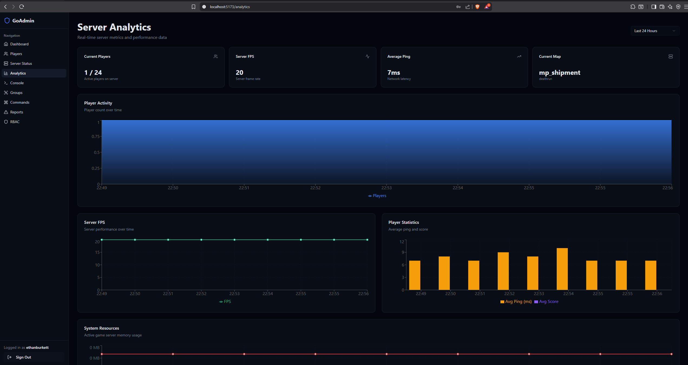
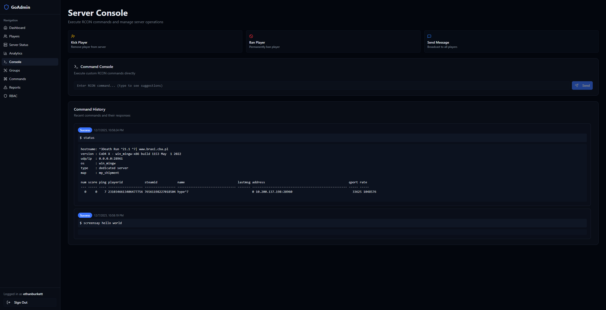
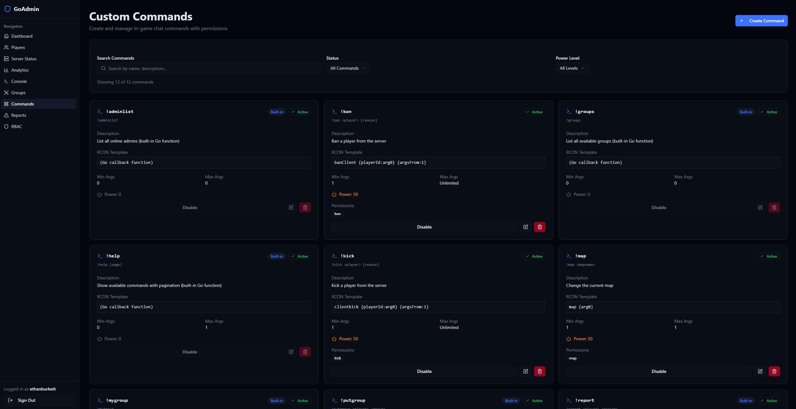
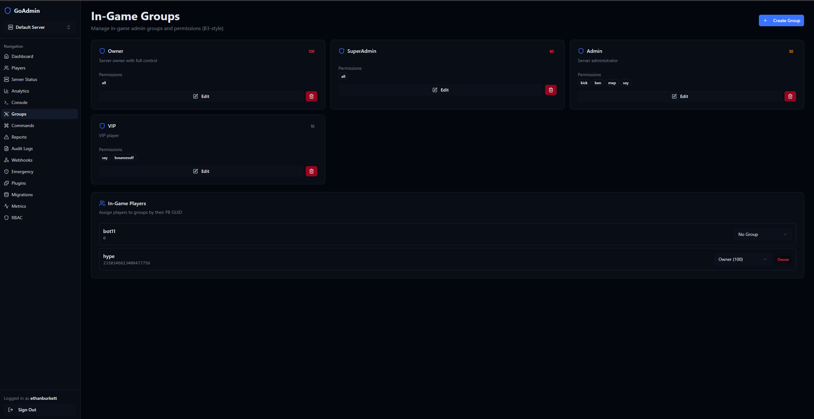
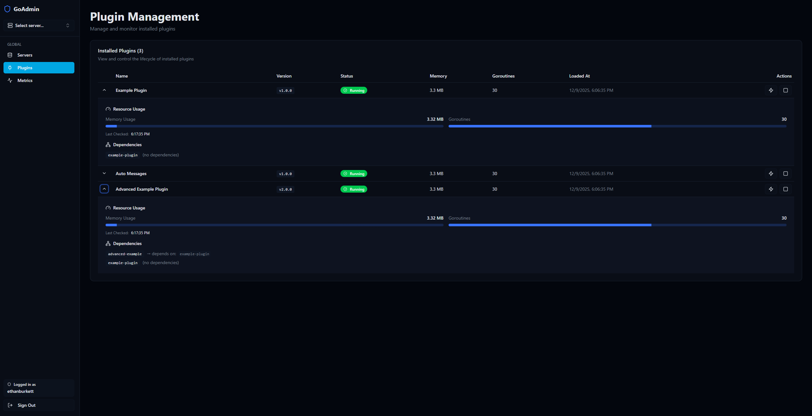
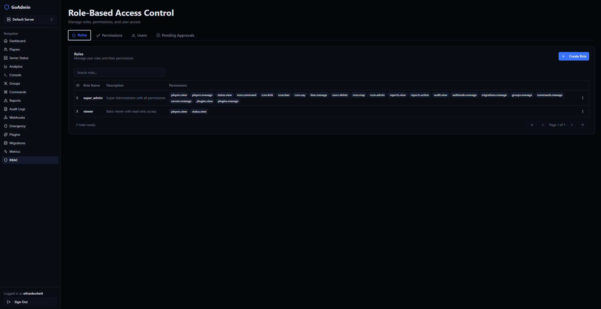

<div align="center">

# 🎮 GoAdmin

### Modern Administration Platform for Call of Duty 4 Servers

[](https://opensource.org/licenses/MIT)
[](https://go.dev/)
[](https://react.dev/)
[](https://www.typescriptlang.org/)

**A powerful, enterprise-grade web panel for CoD4 servers featuring real-time monitoring, advanced player management, and extensible plugin architecture.**

[Features](#-features) • [Screenshots](#-screenshots) • [Installation](#-installation) • [Documentation](#-documentation) • [Plugins](PLUGINS.md)

</div>

---

## 📸 Screenshots

<div align="center">

### Analytics Dashboard



### Real-time RCON Console



### Custom Command Builder



### Group Management (B3-Style Power Groups)



### Audit Logs (Administrative Action Tracking)


### Plugin Management (Hot Reload, Resource Monitoring)



### RBAC System (Role-Based Access Control)



</div>

---

## ✨ Features

<table>
<tr>
<td width="50%">

### 🎯 Server Management

- **Real-time Monitoring** - Live player counts, server stats, map rotation
- **Multi-Server Support** - Manage multiple CoD4 instances from one dashboard
- **RCON Integration** - Direct server control with permission-based access
- **Log Monitoring** - Real-time games_mp.log parsing and event processing
- **Analytics Dashboard** - Player trends, server uptime, command history

</td>
<td width="50%">

### 👥 Player Management

- **Live Player View** - See who's online with real-time updates
- **Player Statistics** - Track performance, playtime, and history
- **Report System** - In-game player reporting with action dashboard
- **Ban Management** - Temporary and permanent bans with auto-expiration
- **Advanced Search** - Filter and find players by GUID, name, or stats

</td>
</tr>
<tr>
<td width="50%">

### 🛡️ Administration

- **RBAC System** - Role-Based Access Control with granular permissions
- **B3-Style Groups** - Power-based hierarchy (Owner: 100, Admin: 50, VIP: 10)
- **User Approval** - Admin-approved registration system
- **Audit Logging** - Complete trail of all administrative actions
- **Webhook Integration** - External notifications for key events

</td>
<td width="50%">

### ⚡ In-Game Commands

- **Custom Commands** - Build RCON commands with dynamic placeholders
- **Smart Placeholders** - `{arg0}`, `{player}`, `{playerId:arg0}`, `{argsFrom:1}`
- **Permission Checks** - Power level and permission-based validation
- **10+ Built-in Commands** - Ready-to-use admin commands
- **Plugin Commands** - Extend with custom Go-based commands

</td>
</tr>
<tr>
<td width="50%">

### 🔌 Plugin System

- **Event-Driven Architecture** - Subscribe to player connect/disconnect events
- **Custom Commands** - Register in-game commands with Go callbacks
- **Full RCON Access** - Execute server commands from plugins
- **Hot Reload** - Update plugin code without server restart
- **Dependency Management** - Automatic dependency resolution and load ordering
- **Resource Monitoring** - Track memory, goroutines, and resource usage
- **Semantic Versioning** - API compatibility validation with version constraints
- **Auto-Import Script** - Automatic plugin discovery and registration

</td>
<td width="50%">

### 🎨 Modern UI/UX

- **React 19** - Latest React with concurrent features
- **shadcn/ui** - Beautiful, accessible component library
- **Dark Mode** - Built-in theme support
- **Responsive Design** - Works on desktop, tablet, mobile
- **Real-time Updates** - TanStack Query for seamless data sync
- **Multi-Server Dashboard** - Switch between servers with dropdown selector

</td>
</tr>
<tr>
<td width="50%">

### 🔄 Database Management

- **Migration System** - Version-controlled schema migrations with rollback
- **Automatic Backups** - Database backup with compression and retention
- **Integrity Validation** - Automated constraint and FK relationship checks
- **Transaction Safety** - ACID guarantees for critical operations
- **Multi-Server Data** - Server-scoped data isolation

</td>
<td width="50%">

### 🔔 Webhook System

- **Event Notifications** - Player bans, reports, and custom events
- **Retry Logic** - Exponential backoff for failed deliveries
- **HMAC Signatures** - SHA256 signing for webhook security
- **Delivery Logs** - Complete audit trail of webhook dispatches
- **Test Endpoint** - Validate webhooks before activation

</td>
</tr>
</table>

---

## 🎮 Built-in Commands

<details>
<summary><b>Click to expand command list</b></summary>

| Command      | Description                             | Example                           |
| ------------ | --------------------------------------- | --------------------------------- |
| `!groups`    | List all available groups               | `!groups`                         |
| `!mygroup`   | Show your current group and permissions | `!mygroup`                        |
| `!putgroup`  | Assign player to a group                | `!putgroup Player1 admin`         |
| `!adminlist` | List all online administrators          | `!adminlist`                      |
| `!help`      | Show paginated help menu                | `!help 2`                         |
| `!report`    | Report a player for admin review        | `!report Player1 cheating`        |
| `!tempban`   | Issue temporary ban                     | `!tempban Player1 2h teamkilling` |
| `!iamgod`    | Claim Owner privileges (first use only) | `!iamgod`                         |

**Ban Duration Formats:** `5m` (minutes), `2h` (hours), `3d` (days), `1M` (months), `2y` (years)

</details>

---

## 🔌 Advanced Plugin System

GoAdmin features an enterprise-grade plugin system with hot-reload, dependency management, and resource monitoring.

<details>
<summary><b>🎯 Core Features</b></summary>

### Hot Reload

- Update plugin code without server restart
- Safe stop → reload → start cycle with automatic fallback
- Web UI button for instant plugin reloads
- Zero downtime for plugin updates

### Dependency Management

- **Automatic Dependency Resolution** - Plugins declare dependencies, system resolves them
- **Topological Sorting** - Kahn's algorithm ensures correct load order
- **Circular Dependency Detection** - Prevents infinite dependency loops
- **Dependency Tree Visualization** - Web UI shows plugin relationships

### Resource Monitoring

- **Real-time Metrics** - Track memory (MB), goroutine count, violations
- **30-Second Updates** - Live metrics refresh in web dashboard
- **Progress Bars** - Visual representation of resource usage
- **Configurable Limits** - Set max memory, CPU, goroutines, timeouts per plugin
- **Violation Tracking** - Log and display resource limit violations

### Semantic Versioning

- **API Compatibility** - Plugins specify min/max API versions
- **Version Validation** - Automatic compatibility checks on load
- **Version Comparison** - SemVer parsing (major.minor.patch)
- **Future-Proof** - Prevents incompatible plugins from loading

</details>

<details>
<summary><b>📦 Creating a Plugin</b></summary>

```go
package myplugin

import (
    "github.com/ethanburkett/goadmin/app/plugins"
)

type MyPlugin struct {
    ctx *plugins.PluginContext
}

func (p *MyPlugin) Metadata() plugins.PluginMetadata {
    return plugins.PluginMetadata{
        ID:          "my-plugin",
        Name:        "My Awesome Plugin",
        Version:     "1.0.0",
        Author:      "Your Name",
        Description: "Does amazing things",
        Dependencies: []string{"example-plugin"}, // Optional
        MinAPIVersion: "1.0.0", // Optional
        MaxAPIVersion: "2.0.0", // Optional
        ResourceLimits: &plugins.ResourceLimits{
            MaxMemoryMB:    100,
            MaxCPUPercent:  50,
            MaxGoroutines:  50,
            Timeout:        30 * time.Second,
        },
    }
}

func (p *MyPlugin) Init(ctx *plugins.PluginContext) error {
    p.ctx = ctx

    // Subscribe to events
    ctx.EventBus.Subscribe("player.connect", func(data map[string]interface{}) {
        playerName := data["playerName"].(string)
        ctx.RCONAPI.Say(fmt.Sprintf("Welcome %s!", playerName))
    })

    // Register custom command
    ctx.CommandAPI.RegisterCommand(&plugins.Command{
        Name:        "hello",
        Description: "Greet the player",
        Handler: func(args plugins.CommandArgs) error {
            return args.Reply(fmt.Sprintf("Hello %s!", args.Player.Name))
        },
    })

    return nil
}

func (p *MyPlugin) Start() error {
    // Start background tasks
    return nil
}

func (p *MyPlugin) Stop() error {
    // Cleanup
    return nil
}

func (p *MyPlugin) Reload() error {
    // Reload configuration
    return nil
}

func init() {
    plugins.Registry.Register(&MyPlugin{})
}
```

</details>

<details>
<summary><b>🚀 Plugin Management</b></summary>

### Auto-Discovery Script

```powershell
# Automatically finds and imports all plugins
.\scripts\build_plugins.ps1
```

### Web Dashboard

- **Start/Stop/Reload** - Control plugins via UI
- **Resource Metrics** - View memory, goroutines, violations
- **Dependency Trees** - Visualize plugin relationships
- **Status Indicators** - Running, Stopped, Error states
- **Expandable Details** - Click rows for detailed metrics

### REST API

```bash
GET    /plugins                    # List all plugins
GET    /plugins/:id                # Get plugin status
POST   /plugins/:id/start          # Start plugin
POST   /plugins/:id/stop           # Stop plugin
POST   /plugins/:id/hot-reload     # Hot reload plugin
GET    /plugins/:id/metrics        # Get resource metrics
GET    /plugins/metrics/all        # Get all plugin metrics
GET    /plugins/:id/dependencies   # Get dependency tree
```

</details>

<details>
<summary><b>📖 Learn More</b></summary>

- **[Complete Plugin Documentation](PLUGINS.md)** - Full API reference and examples
- **[Example Plugins](plugins/examples/)** - Working examples to get started
- **Advanced Example** - Demonstrates all plugin features including dependencies, versioning, and resource limits

</details>

---

## 🎮 Built-in Commands

<div align="center">

### Backend


### Frontend


</div>

---

## 🚀 Installation

### Prerequisites

<table>
<tr>
<td>

**Required:**

- Go 1.21 or higher
- Node.js 18+ with pnpm
- CoD4 server with RCON enabled

</td>
<td>

**Recommended:**

- Linux/Windows/macOS
- 2GB+ RAM
- SSD for database

</td>
</tr>
</table>

### Quick Start

```bash
# Clone repository
git clone https://github.com/ethanburkett/GoAdmin.git
cd GoAdmin

# Configure
cp config.example.json config.json
```

**Edit `config.json`:**

```json
{
  "server": {
    "host": "localhost", // CoD4 server IP
    "port": 28960, // CoD4 server port
    "rcon_password": "your_rcon_password"
  },
  "games_mp_path": "path/to/games_mp.log", // Log file location
  "rest_port": 8080, // API port
  "environment": "development" // development | production
}
```

**Launch:**

```bash
# Install dependencies and start dev servers
pnpm run deps
pnpm dev
```

🌐 **Dashboard:** `http://localhost:5173`  
🔌 **API:** `http://localhost:8080`

### First-Time Setup

1. **Register Account**  
   Navigate to `http://localhost:5173` and create your account

2. **Claim Dashboard Owner**  
   Visit `http://localhost:8080/auth/iamgod` to grant yourself Owner privileges

3. **Claim In-Game Admin**  
   Type `!iamgod` in-game to receive Owner group (100 power)

4. **Approve Users**  
   Manage user access via Dashboard → RBAC

---

## 📚 Documentation

### Custom Command Placeholders

Build dynamic RCON commands with these placeholders:

| Placeholder             | Description                           | Example                             |
| ----------------------- | ------------------------------------- | ----------------------------------- |
| `{arg0}`, `{arg1}`, ... | Command arguments                     | `{arg0}` → first argument           |
| `{player}`              | Player name                           | `{player}` → "Player1"              |
| `{guid}`                | Player GUID                           | `{guid}` → "abc123..."              |
| `{playerId:arg0}`       | Auto-resolve player name to entity ID | `{playerId:arg0}` → "5"             |
| `{argsFrom:1}`          | Join all args from index              | `{argsFrom:1}` → "reason text here" |

**Example Command:**

```
Command: !announce
RCON: say ^1[ADMIN] ^7{argsFrom:0}
Min Power: 50
Result: !announce Server restarting → say ^1[ADMIN] ^7Server restarting
```

### Power Groups

GoAdmin uses B3-style power-based groups:

```
┌─────────────────────────────────┐
│ OWNER (100)  - Full Control     │
├─────────────────────────────────┤
│ ADMIN (50)   - Moderation       │
├─────────────────────────────────┤
│ VIP (10)     - Basic Privileges │
├─────────────────────────────────┤
│ USER (0)     - No Permissions   │
└─────────────────────────────────┘
```

Assign players with `!putgroup <player> <group>` or via dashboard.

---

## 🔌 Plugin Development

GoAdmin features a powerful plugin system for extending functionality.

**Quick Start:**

```go
package myplugin

import "github.com/ethanburkett/goadmin/app/plugins"

type MyPlugin struct {
    ctx *plugins.PluginContext
}

func (p *MyPlugin) Metadata() plugins.PluginMetadata {
    return plugins.PluginMetadata{
        ID:      "my-plugin",
        Name:    "My Plugin",
        Version: "1.0.0",
        Author:  "Your Name",
    }
}

func (p *MyPlugin) Init(ctx *plugins.PluginContext) error {
    p.ctx = ctx
    return nil
}

func (p *MyPlugin) Start() error {
    // Subscribe to events
    p.ctx.EventBus.Subscribe("player.connect", func(data interface{}) {
        // Handle player join
    })

    // Register custom command
    p.ctx.CommandAPI.RegisterCommand(plugins.CommandDefinition{
        Name: "hello",
        Handler: func(player, guid string, args []string) error {
            p.ctx.RCONAPI.SendCommand(`say "Hello World!"`)
            return nil
        },
    })

    return nil
}

func (p *MyPlugin) Stop() error { return nil }
func (p *MyPlugin) Reload() error { return nil }

func init() {
    plugins.Registry.Register(&MyPlugin{})
}
```

**Auto-Import and Build:**

```bash
.\scripts\build_plugins.ps1
go build -o goadmin app/main.go
```

📖 **Full Documentation:** [PLUGINS.md](PLUGINS.md)

---

## 💾 Database Management

GoAdmin includes enterprise-grade database tools for migrations, backups, and integrity validation.

<details>
<summary><b>🔄 Migration System</b></summary>

### Version-Controlled Migrations

- **Automatic Tracking** - Migration version and history tables
- **Transaction Safety** - All migrations run in ACID-compliant transactions
- **Rollback Support** - Revert to previous schema versions
- **Web UI** - Manage migrations from dashboard
- **REST API** - Programmatic migration control

### 8 Built-in Migrations

1. **Initial Schema** - Core tables (users, sessions, roles, permissions, etc.)
2. **Audit Logs** - Administrative action tracking
3. **Webhooks** - Event notification system
4. **Migration Tracking** - Self-hosting migration infrastructure
5. **Permission Constraints** - CASCADE foreign keys for RBAC
6. **Performance Indexes** - Optimized queries on FKs
7. **Command Permissions** - Normalized many-to-many relationships
8. **Server Instances** - Multi-server data isolation

```bash
# View migration status
curl http://localhost:8080/migrations/status

# Apply pending migrations
curl -X POST http://localhost:8080/migrations/apply/all
```

</details>

<details>
<summary><b>💿 Backup & Restore</b></summary>

### Automated Backups

```powershell
# Create compressed backup
.\scripts\backup_db.ps1

# Automatic cleanup (keeps last 10 backups)
# Includes: goadmin.db, goadmin.db-wal, goadmin.db-shm
# Format: backup_YYYYMMDD_HHMMSS.zip
```

### Restore from Backup

```powershell
# Restore database from backup
.\scripts\restore_db.ps1 -BackupFile "backup_20250109_120000.zip"

# Force overwrite existing database
.\scripts\restore_db.ps1 -BackupFile "backup.zip" -Force
```

</details>

<details>
<summary><b>🔍 Integrity Validation</b></summary>

### Database Health Check

```powershell
# Validate all constraints and relationships
.\scripts\validate_db.ps1

# JSON output for automation
.\scripts\validate_db.ps1 | ConvertFrom-Json
```

**Validation Checks:**

- ✅ Orphaned sessions (users deleted but sessions remain)
- ✅ Orphaned role assignments
- ✅ Orphaned permission assignments
- ✅ Orphaned reports (reviewer user deleted)
- ✅ Orphaned temp bans (banned by user deleted)
- ✅ Orphaned command history
- ✅ Orphaned in-game players (group deleted)
- ✅ Missing indexes on foreign keys
- ✅ Constraint violations with severity levels

**Output:**

```json
{
  "errors": 0,
  "warnings": 2,
  "info": 5,
  "results": [
    {
      "check": "Orphaned Sessions",
      "severity": "error",
      "count": 0,
      "message": "All sessions have valid user references"
    }
  ]
}
```

</details>

---

## 🏗️ Development

### Project Structure

```
GoAdmin/
├── app/
│   ├── commands/        # In-game command handlers
│   ├── config/          # Configuration management
│   ├── database/        # Database models and migrations
│   ├── logger/          # Logging utilities
│   ├── models/          # Data models
│   ├── parser/          # Log file parser
│   ├── plugins/         # Plugin system core
│   ├── rcon/            # RCON client
│   ├── rest/            # REST API endpoints
│   ├── watcher/         # Log file watcher
│   └── webhook/         # Webhook dispatcher
├── frontend/
│   ├── src/
│   │   ├── components/  # React components
│   │   ├── hooks/       # Custom React hooks
│   │   ├── pages/       # Route pages
│   │   ├── providers/   # Context providers
│   │   └── lib/         # Utilities
│   └── public/          # Static assets
├── plugins/
│   └── examples/        # Example plugins
└── scripts/             # Build and utility scripts
```

### Build for Production

```bash
# Backend
go build -o goadmin app/main.go

# Frontend
cd frontend
pnpm build
```

### Running Tests

```bash
# Backend tests
go test ./...

# Frontend tests
cd frontend
pnpm test
```

---

## 🔒 Security

GoAdmin implements enterprise-grade security practices:

- 🔐 **bcrypt Password Hashing** - Industry-standard password security
- 🎟️ **Session Tokens** - Secure, expiring authentication tokens
- 🛡️ **RBAC** - Role-Based Access Control with granular permissions
- ✅ **User Approval** - Admin-approved registration system
- 🔍 **Command Validation** - Power level and permission checks
- 📝 **Audit Logging** - Complete action history tracking
- 🚫 **SQL Injection Protection** - Parameterized queries via GORM
- 🔒 **XSS Prevention** - React automatic escaping

---

## 🤝 Contributing

We welcome contributions! Here's how to get started:

1. **Fork** the repository
2. **Create** a feature branch (`git checkout -b feature/amazing-feature`)
3. **Commit** your changes (`git commit -m 'Add amazing feature'`)
4. **Push** to the branch (`git push origin feature/amazing-feature`)
5. **Open** a Pull Request

### Development Guidelines

- Follow Go and TypeScript best practices
- Write tests for new features
- Update documentation
- Keep commits atomic and descriptive

---

## 📝 License

This project is licensed under the **MIT License** - see the [LICENSE](LICENSE) file for details.

---

## 💝 Acknowledgments

- **B3 (BigBrotherBot)** - Inspiration for the command and group system
- **CoD4 Community** - Continued support and server hosting
- **Contributors** - Everyone who has helped improve GoAdmin

---

<div align="center">

### ⭐ Star us on GitHub!

Made with ❤️ for the Call of Duty 4 community

[Report Bug](https://github.com/ethanburkett/GoAdmin/issues) • [Request Feature](https://github.com/ethanburkett/GoAdmin/issues) • [Documentation](PLUGINS.md)

</div>
